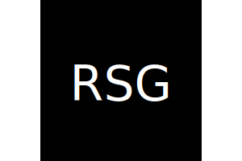
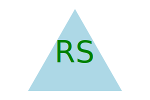

# Robs-SVG-Generator

[](https://opensource.org/licenses/MIT)

## Description

This repository was created as a part of the University of Richmond's Bootcamp, Module 10 Challenge. This command-line application will generate a SVG logo based on the user's input.

The following node modules were utilized in this project:
`FS, Inquirer, Jest, Babel`

The following User Story and Acceptance Criteria were provided for this challenge:

> ## User Story
>
> ```md
> AS a freelance web developer
> I WANT to generate a simple logo for my projects
> SO THAT I don't have to pay a graphic designer
> ```
>
> ## Acceptance Criteria
>
> ```md
> GIVEN a command-line application that accepts user input
> WHEN I am prompted for text
> THEN I can enter up to three characters
> WHEN I am prompted for the text color
> THEN I can enter a color keyword (OR a hexadecimal number)
> WHEN I am prompted for a shape
> THEN I am presented with a list of shapes to choose from: circle, triangle, and square
> WHEN I am prompted for the shape's color
> THEN I can enter a color keyword (OR a hexadecimal number)
> WHEN I have entered input for all the prompts
> THEN an SVG file is created named `logo.svg`
> AND the output text "Generated logo.svg" is printed in the command line
> WHEN I open the `logo.svg` file in a browser
> THEN I am shown a 300x200 pixel image that matches the criteria I entered
> ```

## Table of Contents

-    [Installation](#installation)
-    [Usage](#usage)
-    [License](#license)
-    [Contributing](#contributing)
-    [Tests](#tests)
-    [Questions](#questions)

## Installation

This application requires Node.js to run. Please visit https://nodejs.org/en/ to download Node.js if it is not already installed on your computer.

If you are unfamiliar with cloning a repository, please click on the following link to learn: [Github docs | Cloning a repository](https://docs.github.com/en/repositories/creating-and-managing-repositories/cloning-a-repository)

To install this application, clone the repository, navigate to its directory in the terminal, and run `npm install` in the command line to install the required dependencies. Then run `node index.js` to start the application.

## Usage

After running `node index.js` in the command line, the user will be prompted with a series of questions. The user will be asked to enter up to three characters for the logo, a color for the text, a shape for the logo, and a color for the shape. After answering all of the questions, the user will be notified that the logo has been generated and the logo will be saved as `logo.svg` in the `./dist` directory. The SVG will have the overall dimensions of 300x200 pixels.

Examples of SVGs generated with this application:

> 
> 
> 

<br></br>

A video demonstration of the application can be found here:

> [Google Drive | Rob's SVG Generator](https://drive.google.com/file/d/157xKsfaev9dZBYycIAMsoV2T2weddooR/view?usp=sharing)

## License

This application is licensed under the MIT license. See the following link for more information: https://opensource.org/licenses/MIT

## Contributing

Feel free to contribute to this project! Please fork the repository and create a pull request with your changes.

## Tests

The Jest module was utilized to run tests. To run the tests, run `npm run test` in the command lin while in the root directory of the project.

## Questions

If you have any questions, please contact me at drgstriker@aol.com. You can also visit my GitHub profile at https://github.com/RobSprouse.
